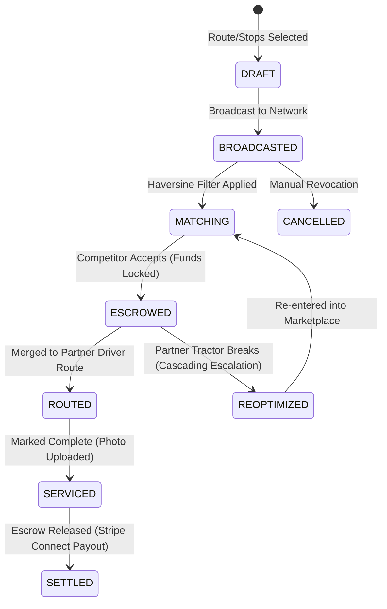
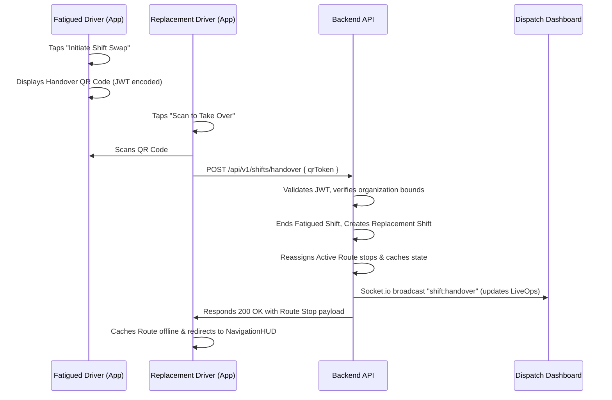

# PlowPath — B2B Subcontracting & Driver Fatigue System
## Architectural & Product Design Specification

This document details the enterprise-grade technical design, product logic, database schemas, and offline-first state machines for two critical pillars of the PlowPath v3.0 platform:
1. **PlowPath Community B2B Peer-to-Peer Subcontracting & Route Sharing Network**
2. **Real-Time Driver Fatigue Monitoring & Safety Fatigue-Engine**

---

## Part 1: B2B Peer-to-Peer Subcontracting Network

### 1.1 Product Vision & Business Workflows (PM Spec)
When winter storms strike, operational continuity is paramount. If a company's vehicle or tractor breaks down, clients cannot be left stranded. The B2B Subcontracting Network allows competing snow removal fleets registered on the PlowPath network to exchange active jobs on a local marketplace.



#### Key Workflows:
1. **The Breakdown Broadcast**: A dispatcher whose fleet experiences a breakdown selects an active route or specific stops, sets a payout rate (e.g., $40/stop), and broadcasts the subcontracting offer.
2. **Proximity-Based Routing**: The backend calculates the Haversine distance between the target properties and active fleets of nearby competitors, matching the closest and most capable crews first.
3. **Escrow & Stripe Connect Settlement**: Payouts are handled via Stripe Connect. When an offer is accepted by a competitor dispatcher, funds are authorized and held in escrow. Upon proof-of-service upload (geofenced photo and notes), the funds are cleared to the partner company's balance.

---

### 1.2 Database Schema Design (Architect Spec)
To support B2B job sharing, we implement strict PostgreSQL table schemas. We enforce multi-tenant isolation utilizing PostgreSQL **Row-Level Security (RLS)**, ensuring competitors can never view each other's proprietary customer contracts or driver routes unless a subcontracted route stop is explicitly shared.

```sql
-- Extensions
CREATE EXTENSION IF NOT EXISTS "uuid-ossp";
CREATE EXTENSION IF NOT EXISTS "postgis";

-- Subcontract Offers Table
CREATE TABLE subcontract_offers (
    id UUID PRIMARY KEY DEFAULT uuid_generate_v4(),
    origin_org_id UUID NOT NULL,
    target_org_id UUID, -- NULL indicates broadcast to all local partner fleets
    offered_payout NUMERIC(10, 2) NOT NULL CHECK (offered_payout > 0.00),
    status VARCHAR(30) NOT NULL DEFAULT 'broadcasted' CHECK (status IN ('draft', 'broadcasted', 'accepted', 'completed', 'cancelled', 'escalated')),
    escrow_payment_intent_id VARCHAR(255),
    created_at TIMESTAMPTZ NOT NULL DEFAULT NOW(),
    updated_at TIMESTAMPTZ NOT NULL DEFAULT NOW(),
    deleted_at TIMESTAMPTZ
);

-- Subcontract Stops Link Table (Maps specific stops to subcontract offers)
CREATE TABLE subcontract_stops (
    id UUID PRIMARY KEY DEFAULT uuid_generate_v4(),
    offer_id UUID NOT NULL REFERENCES subcontract_offers(id) ON DELETE CASCADE,
    route_stop_id UUID NOT NULL, -- References route_stops table
    accepted_by_org_id UUID,
    assigned_driver_id UUID,
    completed_at TIMESTAMPTZ,
    proof_photo_url VARCHAR(512),
    notes TEXT,
    created_at TIMESTAMPTZ NOT NULL DEFAULT NOW(),
    updated_at TIMESTAMPTZ NOT NULL DEFAULT NOW(),
    deleted_at TIMESTAMPTZ
);

-- Indexes for performance
CREATE INDEX idx_subcontract_offers_origin ON subcontract_offers(origin_org_id) WHERE deleted_at IS NULL;
CREATE INDEX idx_subcontract_stops_offer ON subcontract_stops(offer_id) WHERE deleted_at IS NULL;
CREATE INDEX idx_subcontract_stops_stop ON subcontract_stops(route_stop_id) WHERE deleted_at IS NULL;

-- Enable PostgreSQL Row-Level Security
ALTER TABLE subcontract_offers ENABLE ROW LEVEL SECURITY;
ALTER TABLE subcontract_stops ENABLE ROW LEVEL SECURITY;

-- RLS Policy: Origin can read/write, Target can read if broadcasted or explicitly targeted
CREATE POLICY select_subcontract_offers ON subcontract_offers
    FOR SELECT
    USING (
        origin_org_id = current_setting('app.current_org_id')::UUID 
        OR target_org_id IS NULL 
        OR target_org_id = current_setting('app.current_org_id')::UUID
    );

CREATE POLICY modify_subcontract_offers ON subcontract_offers
    FOR ALL
    USING (origin_org_id = current_setting('app.current_org_id')::UUID);
```

---

### 1.3 Real-Time Network & Offline-First Sync Invariants (Engineer Spec)
Drivers in the field operates under low-connectivity storm conditions. The mobile application must handle subcontracted properties seamlessly while keeping all background GPS queues offline-resilient.

#### Real-Time Broadcast Logic (Socket.io)
When a subcontract offer is broadcasted, Socket.io transmits a real-time event restricted to dispatchers within the geographic bounding box of the properties:
```typescript
// Backend: Broadcast to regional rooms
const regionalRoom = `marketplace:bounding-box:${countyCode}`;
io.to(regionalRoom).emit("subcontract:broadcast", {
    offerId: offer.id,
    stopCount: stops.length,
    totalPayout: offer.offered_payout,
    centroid: calculateCentroid(stops)
});
```

#### Offline Sync Flow (React Native AsyncStorage)
1. **Merged Offline Schema**: When a competitor dispatcher accepts the offer, the backend appends the stops to their chosen driver's active route sequence and pushes the update via FCM.
2. **Mobile Caching Invariant**: The mobile driver's local route store cache (`plowpath.routeCache.v1`) is updated. The subcontracted stops are injected into their offline stop list but bear a distinct `is_subcontracted: true` metadata flag.
3. **Queue Completion Dispatch**:
   - The driver completes the subcontracted stop offline.
   - The photo is compressed locally to `<200KB` and stored in `plowpath.photoQueue.v1`.
   - The completion status is queued in `plowpath.stopQueue.v1`.
   - When connection is recovered (`NetInfo` triggers online), the photo uploads to S3/Cloudinary first, then the completion queue flushes. Upon server ingestion, the Stripe Escrow triggers release.

---

## Part 2: Real-Time Driver Fatigue Monitoring & Safety Engine

### 2.1 Fatigue-Engine Specifications (PM Spec)
Snow plowing is exhausting work, often extending into 12+ hour overnight shifts. To ensure driver safety and satisfy labor compliance, the platform tracks active continuous driving hours and triggers mandatory shift handovers.

- **Shift Timer**: Tracks continuous elapsed active duty hours (GPS streaming active, vehicle moving).
- **Fatigue Tiers**:
  - **Tier 1 (Amber Flag)**: Active duty reaches **8 hours**. Notification sent to dispatcher and driver.
  - **Tier 2 (Red Flag)**: Active duty reaches **12 hours**. Escalated alert pushed to dispatcher map, suggesting a shift swap.
  - **Tier 3 (Critical Handover)**: Active duty reaches **14 hours**. Persistent screen lock warnings activate on mobile until a shift swap QR code is scanned or dispatcher overrides.

---

### 2.2 Shift Tracking Database Schemas (Architect Spec)
```sql
-- Driver Shifts Table
CREATE TABLE driver_shifts (
    id UUID PRIMARY KEY DEFAULT uuid_generate_v4(),
    driver_id UUID NOT NULL,
    org_id UUID NOT NULL,
    started_at TIMESTAMPTZ NOT NULL DEFAULT NOW(),
    last_heartbeat_at TIMESTAMPTZ NOT NULL DEFAULT NOW(),
    ended_at TIMESTAMPTZ,
    break_duration_seconds INTEGER DEFAULT 0,
    cumulative_active_seconds INTEGER DEFAULT 0,
    status VARCHAR(30) NOT NULL DEFAULT 'active' CHECK (status IN ('active', 'on_break', 'ended')),
    created_at TIMESTAMPTZ NOT NULL DEFAULT NOW(),
    updated_at TIMESTAMPTZ NOT NULL DEFAULT NOW(),
    deleted_at TIMESTAMPTZ
);

-- Driver Shift Heartbeats (Stores raw minute-by-minute motion indicators)
CREATE TABLE driver_shift_heartbeats (
    id UUID PRIMARY KEY DEFAULT uuid_generate_v4(),
    shift_id UUID NOT NULL REFERENCES driver_shifts(id) ON DELETE CASCADE,
    recorded_at TIMESTAMPTZ NOT NULL DEFAULT NOW(),
    is_moving BOOLEAN NOT NULL DEFAULT FALSE,
    battery_level NUMERIC(3, 2),
    gps_coordinates GEOGRAPHY(POINT, 4326) NOT NULL
);

-- Indexes
CREATE INDEX idx_driver_shifts_active ON driver_shifts(driver_id) WHERE status = 'active' AND deleted_at IS NULL;
CREATE INDEX idx_shift_heartbeats_time ON driver_shift_heartbeats(shift_id, recorded_at DESC);
```

---

### 2.3 Shift Swap & QR Code Handover Mechanics (Engineer Spec)
To make shift handovers as simple as possible for fatigued, glove-wearing drivers, the platform implements a secure, **one-tap QR code swap**.



#### JWT Handover Payload Format
The handover QR code contains a lightweight, short-lived (5-minute expiration) encrypted JWT containing the state signature:
```json
{
  "sub": "driver_shift_handover",
  "shiftId": "e305e714-fa0f-48db-9230-22c66de9475c",
  "routeId": "249d95cf-ce98-4e1b-9e23-74d1a580a1ad",
  "exp": 1779836400
}
```

#### API Handover Handler:
```typescript
import { Request, Response } from 'express';
import jwt from 'jsonwebtoken';
import { db } from '../services/db.service';

export async function handleShiftHandover(req: Request, res: Response) {
    const { qrToken } = req.body;
    const replacementDriverId = req.user.id; // From Bearer JWT
    const orgId = req.user.orgId;

    try {
        const decoded = jwt.verify(qrToken, process.env.JWT_SECRET!) as any;
        if (decoded.sub !== "driver_shift_handover") {
            return res.status(400).json({ error: "Invalid handover token type." });
        }

        const currentShift = await db.query(
            `SELECT * FROM driver_shifts WHERE id = $1 AND org_id = $2 AND status = 'active'`,
            [decoded.shiftId, orgId]
        );

        if (currentShift.rows.length === 0) {
            return res.status(404).json({ error: "Active shift not found." });
        }

        // Transactional shift swap
        await db.transaction(async (client) => {
            // 1. End old shift
            await client.query(
                `UPDATE driver_shifts SET status = 'ended', ended_at = NOW() WHERE id = $1`,
                [decoded.shiftId]
            );

            // 2. Start new shift
            const newShift = await client.query(
                `INSERT INTO driver_shifts (driver_id, org_id, status) VALUES ($1, $2, 'active') RETURNING id`,
                [replacementDriverId, orgId]
            );

            // 3. Reassign route driver
            await client.query(
                `UPDATE routes SET driver_id = $1 WHERE id = $2`,
                [replacementDriverId, decoded.routeId]
            );
        });

        // Broadcast real-time LiveOps updates
        req.io.to('dashboard').emit('shift:handover', {
            routeId: decoded.routeId,
            newDriverId: replacementDriverId
        });

        return res.status(200).json({ message: "Handover completed successfully." });
    } catch (err) {
        return res.status(401).json({ error: "Invalid or expired handover token." });
    }
}
```

---

## Part 3: Operational Edge Cases & Failsafe Architecture

1. **Cascading Breakdown Escalation (Timeout Check)**:
   - When a subcontract offer is posted, a partner fleet has 15 minutes to accept it.
   - If the timer expires with no takers, a Bull Queue job (`subcontract-escalation`) executes, triggering automated notifications (SMS and direct Dispatch Alerts) to the next tier of partner fleets, or automatically flags the job back to the originating dispatcher to schedule a manual redirect.
2. **Dynamic Route Auto-Reoptimization**:
   - Tapping "Accept Offer" recalculates the entire competitor route list locally.
   - The mobile device uses OSRM's coordinate sequence table to merge the new stop into the driver's active path, ensuring they don't drive back and forth across the city unnecessarily.
3. **Escrow Split-Claims Mitigation**:
   - In case of client disputes (e.g. customer asserts driveway was not fully plowed but the competitor driver marked it complete), the proof-of-service geofenced photo (compressed S3 file) and timestamped GPS heartbeat data are pulled into a joint dispatcher arbitration console to verify service instantly.
